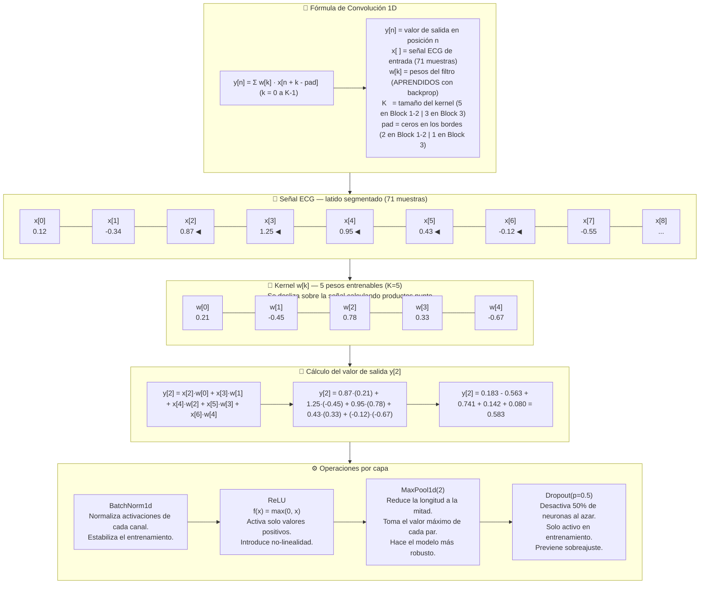
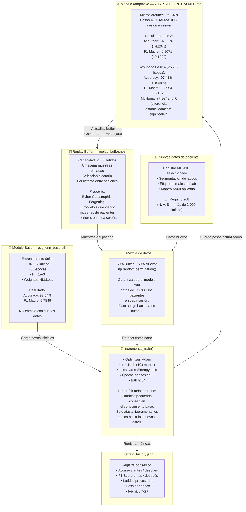
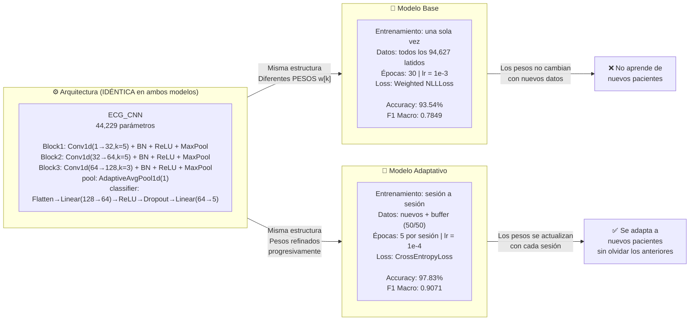

# ADAPT-ECG — Arquitectura CNN para Detección de Arritmias
**Elias Bejarano Lozada #20213057 — Residencia Profesional — ITT**

---

## Diagrama 1 — Operación de Convolución 1D (Matemáticas)

---

## Diagrama 2 — Pipeline Completo CNN (Forward Pass / Inferencia)

```mermaid
flowchart LR
    subgraph INPUT["📥 INPUT"]
        I["Latido ECG\nsegmentado\ny normalizado\n\nTensor:\nbatch × 1 × 71\n\n71 muestras:\n35 antes del pico R\n+ pico R\n+ 36 después"]
    end

    subgraph B1["🔷 BLOQUE 1"]
        B1C["Conv1d\nin=1 → out=32\nkernel=5, pad=2\n→ batch×32×71\n32 filtros distintos"]
        B1N["BatchNorm1d(32)\n+ ReLU\nNormaliza y activa"]
        B1P["MaxPool1d(2)\n71 → 35 muestras"]
        B1C --> B1N --> B1P
    end

    subgraph B2["🔷 BLOQUE 2"]
        B2C["Conv1d\nin=32 → out=64\nkernel=5, pad=2\n→ batch×64×35\nCombina patrones B1"]
        B2N["BatchNorm1d(64)\n+ ReLU\nPatrones más complejos"]
        B2P["MaxPool1d(2)\n35 → 17 muestras"]
        B2C --> B2N --> B2P
    end

    subgraph B3["🔷 BLOQUE 3"]
        B3C["Conv1d\nin=64 → out=128\nkernel=3, pad=1\n→ batch×128×17\nRepresentación alto nivel"]
        B3N["BatchNorm1d(128)\n+ ReLU\nMorfología completa del latido"]
        B3P["MaxPool1d(2)\n17 → 8 muestras"]
        B3C --> B3N --> B3P
    end

    subgraph POOL["🔹 POOLING GLOBAL"]
        AP["AdaptiveAvgPool1d(1)\n8 → 1 muestra\nPromedia cada canal\nbatch×128×1"]
        FL["Flatten\nbatch×128×1\n→ batch×128\nVector 1D"]
        AP --> FL
    end

    subgraph CLAS["🔸 CLASIFICADOR (self.classifier)"]
        L1["Linear(128 → 64)\n8,192 pesos + 64 bias\nComprime la representación"]
        RU["ReLU\nf(x) = max(0, x)"]
        DR["Dropout(p=0.5)\n50% neuronas desactivadas\nSolo en entrenamiento"]
        L2["Linear(64 → 5)\n320 pesos + 5 bias\n5 logits — uno por clase"]
        L1 --> RU --> DR --> L2
    end

    subgraph OUTPUT["📤 SALIDA"]
        SM["Softmax\npredict_proba()\n5 probabilidades\nSuma = 1.0"]
        N["🔵 N — Normal\n79.3% del dataset"]
        S["🟠 S — Supraventricular\n3.2% del dataset"]
        V["🔴 V — Ventricular\n7.6% del dataset"]
        F["🟣 F — Fusión\n0.8% del dataset"]
        Q["⚫ Q — Desconocido\n9.0% del dataset"]
        SM --> N
        SM --> S
        SM --> V
        SM --> F
        SM --> Q
    end

    INPUT -->|"batch×1×71"| B1
    B1 -->|"batch×32×35"| B2
    B2 -->|"batch×64×17"| B3
    B3 -->|"batch×128×8"| POOL
    POOL -->|"batch×128"| CLAS
    CLAS -->|"5 logits"| OUTPUT
```

### Resumen de dimensiones del tensor

```mermaid
flowchart LR
    D0["Input\n1 × 71"]
    D1["Block 1\n32 × 35"]
    D2["Block 2\n64 × 17"]
    D3["Block 3\n128 × 8"]
    D4["AvgPool\n128 × 1"]
    D5["Flatten\n128"]
    D6["Linear 1\n64"]
    D7["Linear 2\n5"]
    D8["Softmax\nN/S/V/F/Q"]

    D0 -->|"Conv+BN+ReLU+MaxPool"| D1
    D1 -->|"Conv+BN+ReLU+MaxPool"| D2
    D2 -->|"Conv+BN+ReLU+MaxPool"| D3
    D3 -->|"AdaptiveAvgPool"| D4
    D4 -->|"Flatten"| D5
    D5 -->|"Linear+ReLU+Dropout"| D6
    D6 -->|"Linear"| D7
    D7 -->|"Softmax"| D8
```

### Conteo de parámetros

| Capa | Fórmula | Parámetros |
|------|---------|-----------|
| Conv1d Block 1 | 1 × 32 × 5 + 32 | 192 |
| Conv1d Block 2 | 32 × 64 × 5 + 64 | 10,304 |
| Conv1d Block 3 | 64 × 128 × 3 + 128 | 24,704 |
| BatchNorm ×3 | 2 × (32 + 64 + 128) | 448 |
| Linear(128→64) | 128 × 64 + 64 | 8,256 |
| Linear(64→5) | 64 × 5 + 5 | 325 |
| **TOTAL** | | **44,229** |

---

## Diagrama 3 — Módulo de Reentrenamiento Continuo

---

## Diagrama 4 — Diferencia entre Modelo Base y Adaptativo

---

*Archivo generado para: Residencia Profesional — Ingeniería Biomédica — ITT — 2026*
