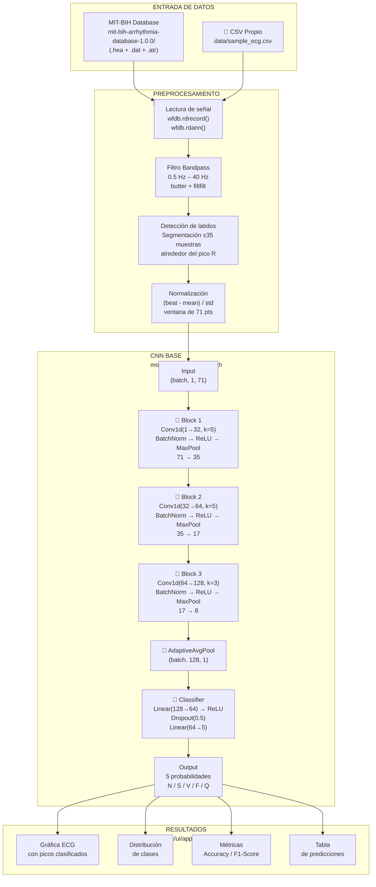
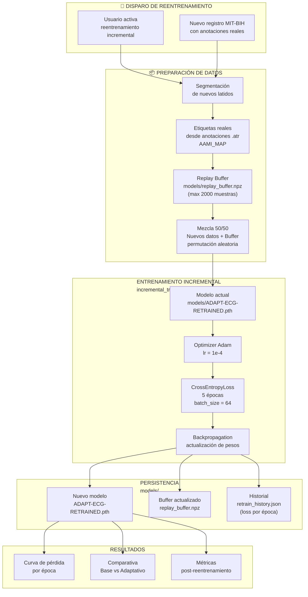
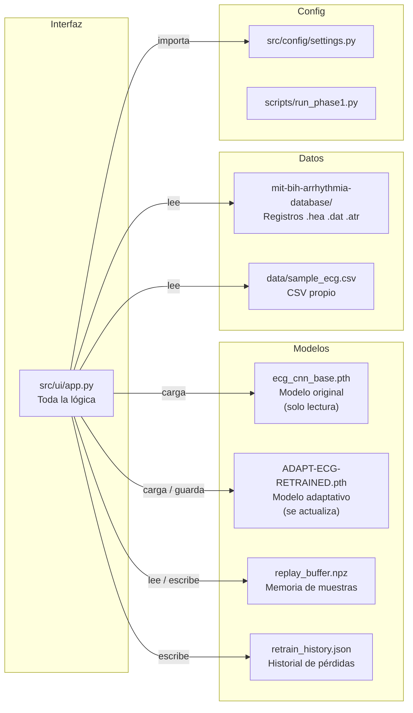

# Diagrama de Flujo — ADAPT-ECG CNN

## Flujo CNN Base (Inferencia)

```mermaid
flowchart TD
    subgraph ENTRADA["ENTRADA DE DATOS"]
        A1["MIT-BIH Database\nmit-bih-arrhythmia-database-1.0.0/\n(.hea + .dat + .atr)"]
        A2["📄 CSV Propio\ndata/sample_ecg.csv"]
    end

    subgraph PREPROCESO["PREPROCESAMIENTO<br/>src/ui/app.py"]
        B1[" Lectura de señal\nwfdb.rdrecord()\nwfdb.rdann()"]
        B2["Filtro Bandpass\n0.5 Hz – 40 Hz\nbutter + filtfilt"]
        B3["Detección de latidos\nSegmentación ±35 muestras\nalrededor del pico R"]
        B4[" Normalización\n(beat - mean) / std\nventana de 71 pts"]
    end

    subgraph MODELO_BASE[" CNN BASE<br/>models/ecg_cnn_base.pth"]
        C1["Input\n(batch, 1, 71)"]
        C2["🔷 Block 1\nConv1d(1→32, k=5)\nBatchNorm → ReLU → MaxPool\n71 → 35"]
        C3["🔷 Block 2\nConv1d(32→64, k=5)\nBatchNorm → ReLU → MaxPool\n35 → 17"]
        C4["🔷 Block 3\nConv1d(64→128, k=3)\nBatchNorm → ReLU → MaxPool\n17 → 8"]
        C5["🔹 AdaptiveAvgPool\n(batch, 128, 1)"]
        C6["🔸 Classifier\nLinear(128→64) → ReLU\nDropout(0.5)\nLinear(64→5)"]
        C7[" Output\n5 probabilidades\nN / S / V / F / Q"]
    end

    subgraph SALIDA_BASE["RESULTADOS<br/>src/ui/app.py<br/>"]
        D1["Gráfica ECG\ncon picos clasificados"]
        D2["Distribución\nde clases"]
        D3["Métricas\nAccuracy / F1-Score"]
        D4["Tabla\nde predicciones"]
    end

    A1 --> B1
    A2 --> B1
    B1 --> B2 --> B3 --> B4
    B4 --> C1
    C1 --> C2 --> C3 --> C4 --> C5 --> C6 --> C7
    C7 --> D1
    C7 --> D2
    C7 --> D3
    C7 --> D4
```

---

## Flujo CNN Adaptativa (Reentrenamiento Incremental)

```mermaid
flowchart TD
    subgraph TRIGGER["🚀 DISPARO DE REENTRENAMIENTO<br/>src/ui/app.py"]
        E1["Usuario activa\nreentrenamiento incremental"]
        E2[" Nuevo registro MIT-BIH\ncon anotaciones reales"]
    end

    subgraph DATOS_RETRAIN["📦 PREPARACIÓN DE DATOS"]
        F1["Segmentación\nde nuevos latidos"]
        F2["Etiquetas reales\ndesde anotaciones .atr\nAAMI_MAP"]
        F3["Replay Buffer\nmodels/replay_buffer.npz\n(max 2000 muestras)"]
        F4["Mezcla 50/50\nNuevos datos + Buffer\npermutación aleatoria"]
    end

    subgraph RETRAIN["ENTRENAMIENTO INCREMENTAL<br/>incremental_train()"]
        G1["Modelo actual\nmodels/ADAPT-ECG-RETRAINED.pth"]
        G2["Optimizer Adam\nlr = 1e-4"]
        G3["CrossEntropyLoss\n5 épocas\nbatch_size = 64"]
        G4["Backpropagation\nactualización de pesos"]
    end

    subgraph GUARDADO["PERSISTENCIA<br/>models/"]
        H1["Nuevo modelo\nADAPT-ECG-RETRAINED.pth"]
        H2["Buffer actualizado\nreplay_buffer.npz"]
        H3["Historial\nretrain_history.json\n(loss por época)"]
    end

    subgraph SALIDA_RETRAIN["RESULTADOS<br/>src/ui/app.py"]
        I1["Curva de pérdida\npor época"]
        I2["Comparativa\nBase vs Adaptativo"]
        I3["Métricas\npost-reentrenamiento"]
    end

    E1 --> F1
    E2 --> F1
    F1 --> F2 --> F3 --> F4
    F4 --> G1 --> G2 --> G3 --> G4
    G4 --> H1
    G4 --> H2
    G4 --> H3
    H1 --> I1
    H1 --> I2
    H1 --> I3
```

---

## Mapa de Archivos del Proyecto

```mermaid
flowchart LR
    subgraph UI["Interfaz"]
        APP["src/ui/app.py\nToda la lógica"]
    end

    subgraph MODELS["Modelos"]
        M1["ecg_cnn_base.pth\nModelo original\n(solo lectura)"]
        M2["ADAPT-ECG-RETRAINED.pth\nModelo adaptativo\n(se actualiza)"]
        M3["replay_buffer.npz\nMemoria de muestras"]
        M4["retrain_history.json\nHistorial de pérdidas"]
    end

    subgraph DATA["Datos"]
        D1["mit-bih-arrhythmia-database/\nRegistros .hea .dat .atr"]
        D2["data/sample_ecg.csv\nCSV propio"]
    end

    subgraph CONFIG["Config"]
        C1["src/config/settings.py"]
        C2["scripts/run_phase1.py"]
    end

    APP -->|"carga"| M1
    APP -->|"carga / guarda"| M2
    APP -->|"lee / escribe"| M3
    APP -->|"escribe"| M4
    APP -->|"lee"| D1
    APP -->|"lee"| D2
    APP -->|"importa"| C1
```
